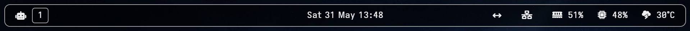
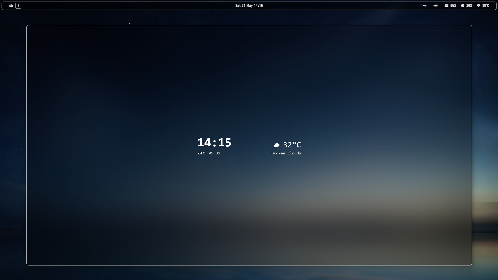
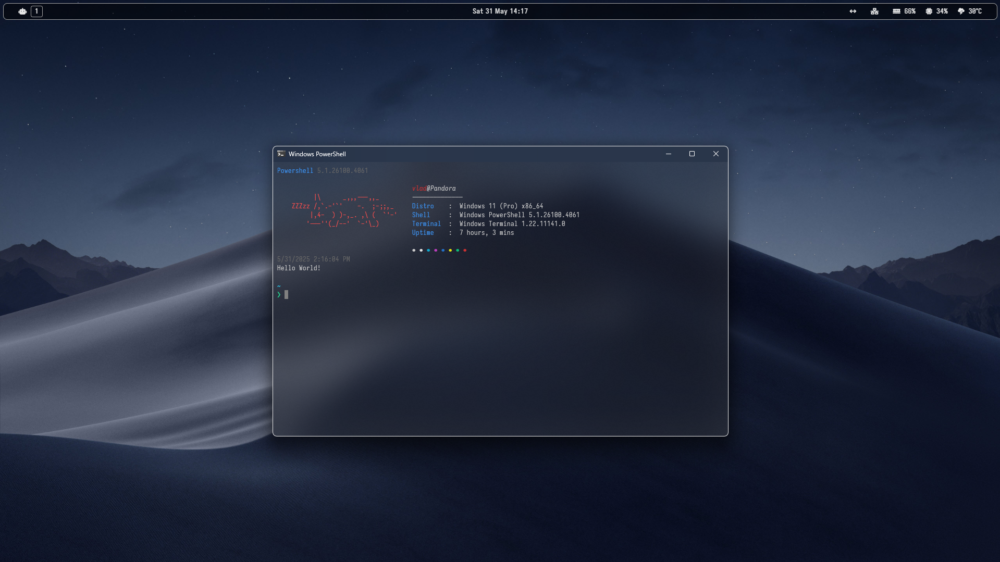
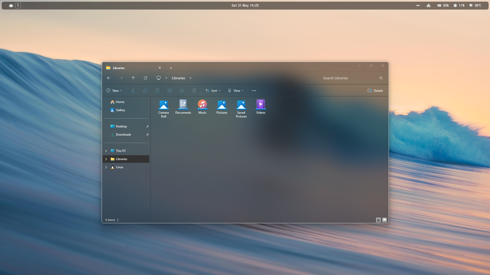

---

## :information_source: Overview

A quick and dirty [Zebar](https://github.com/zebar-dev/zebar) config based on the provided starters upon install. This was made to match my rice on Windows 11. Changes include:

- Floating bar with outline
- Workspace indicators for active and on hover
- Changes to font, colors, and transparency
- Icon change from Nerdfonts to Fontawesome

## :bulb: Usage

Clone and copy this repo to your Zebar config directory (e.g. `../zebar/zebar-outline`).

> [!NOTE]  
> Configured with dark wallpapers in mind. Feel free to change the colors in `styles.css` to accomodate your preferences.

## :camera: Screenshots

## :white_check_mark:  To do
- [ ] Add blur (if possible)
- [ ] Add function to icons
- [ ] Clock location to the left and put window name to middle of bar

--- 

*Thanks!*